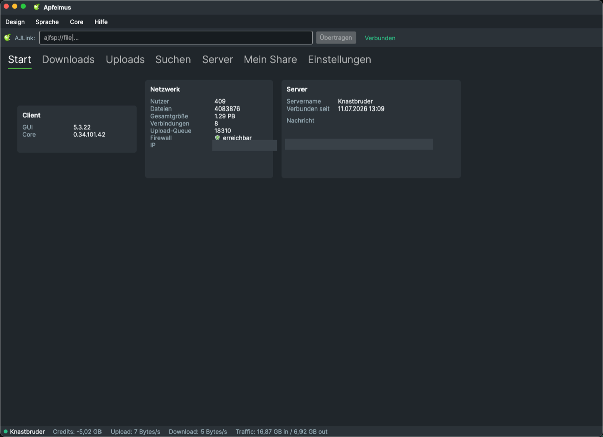
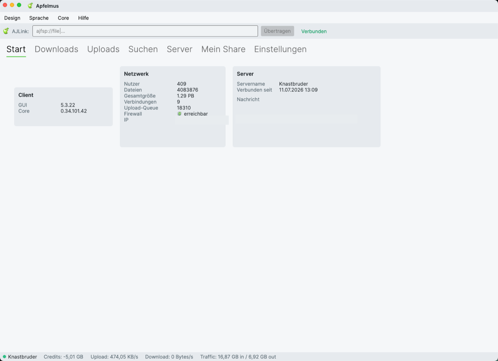

# Apfelmus

Plattformübergreifende Desktop-GUI für das **appleJuice**-Netzwerk (ein eDonkey2000-verwandtes P2P-Filesharing-Protokoll), gebaut mit [Avalonia](https://avaloniaui.net/) und lauffähig unter **Windows, macOS und Linux**. Die Anwendung verbindet sich über eine XML/HTTP-API mit einem separat laufenden appleJuice-**Core** und zeigt bzw. steuert dessen Zustand.

Mehrsprachig (Deutsch/Englisch/Italienisch, zur Laufzeit umschaltbar), zwei Farbschemata (Dunkel/Hell, Anthrazit + Grün) und eine eigene rahmenlose Titelleiste.

> **Hinweis:** Bis 5.2.x war Apfelmus ein reiner **WPF**-Client (nur Windows). Ab 5.3 ist die Avalonia-Variante die Hauptanwendung. Der alte WPF-Client ist im Branch [`wpf-legacy`](../../tree/wpf-legacy) archiviert.

## Screenshots

Umschaltbares Hell-/Dunkel-Design (Anthrazit + Grün) – zur Laufzeit über **Design** im Menü:

<p>
  
  
</p>

## Funktionsbereiche

- **Start** – GUI-/Core-Version, Netzwerkstatus (Nutzer, Dateien, Gesamtgröße, offene Verbindungen, Upload-Queue, Firewall, eigene IP) und der verbundene Server
- **Downloads** – laufende Downloads inkl. Status, Speed, Restzeit, Fortschritt und Powerdownload-Bietsystem; darunter die **Quellen** und ein **Partlisten-Verfügbarkeitsbalken**. Aktionen auch für Mehrfachauswahl, Tastenkürzel **F2–F9**
- **Uploads** – aktive Uploads und Warteschlange
- **Suchen** – Volltextsuche mit einem eigenen Ergebnis-Tab je Suchlauf
- **Server** – bekannte appleJuice-Server, Verbindungsstatus, offizielle Serverliste holen
- **Mein Share** – Verzeichnisbaum zum Freigeben/Entfernen von Ordnern, Freitextfilter, Prioritäten, Link(s)/Quelle(n) kopieren
- **Einstellungen** – GUI-Optionen sowie die kompletten Core-Einstellungen (Nick, Verzeichnisse, Ports, Limits, Speed pro Slot, Autoconnect) und Passwortänderung

Geklickte `ajfsp://`-Links aus dem Browser werden an Apfelmus (und damit an den Core) übergeben; die App holt sich dabei in den Vordergrund und wechselt auf den Downloads-Tab. Wie die Verknüpfung je Plattform registriert wird, steht unter [ajfsp://-Linkübernahme](#ajfsp-linkübernahme).

## Projektstruktur

| Projekt | Inhalt |
|---|---|
| `Apfelmus.Avalonia` | Die Avalonia-GUI (Views, ViewModels, Converter, Themes, i18n, Services) – die eigentliche Anwendung |
| `ApfelmusFramework` | **Plattformneutrale Kernbibliothek (`net10.0`):** Core-Kommunikation (XML/HTTP-API), Datenmodelle/DTOs, XML-(De)Serialisierung, Config und Hilfslogik. Bewusst UI-frameworkunabhängig |
| `ConfigMigrator` | Einmal-Kommandozeilentool zur Migration alter `Config.dat` (BinaryFormatter) auf `Config.xml` (XmlSerializer), siehe unten |

Der alte WPF-Client (`Apfelmus`, `WpfCustomControlLibrary1`) liegt im Branch `wpf-legacy`.

## Konfigurationsmigration (Config.dat → Config.xml)

Ältere Installationen speichern ihre Einstellungen in `%AppData%\Apfelmus\Config.dat` (per `BinaryFormatter`). Aktuelle Versionen verwenden stattdessen `Config.xml` (per `XmlSerializer`) – dadurch hat die App selbst keine `BinaryFormatter`-Abhängigkeit mehr, die es ab .NET 9 ohnehin nicht mehr gibt.

Beim ersten Start ohne vorhandene `Config.xml` legt Apfelmus einfach eine neue, leere Konfiguration an. Um stattdessen die bisherigen Einstellungen (Server, Passwort, Sprache, Theme, …) zu übernehmen, einmalig das Migrationstool ausführen:

```
dotnet run --project ConfigMigrator
```

Das Tool liest `Config.dat`, schreibt `Config.xml` im selben Ordner und benennt die alte Datei anschließend in `Config.dat.bak` um (sie wird nicht gelöscht).

## Installation aus den [Releases](../../releases)

Alle drei Downloads sind **self-contained** – ein separat installiertes .NET wird **nicht** benötigt. In jedem Fall muss ein appleJuice-**Core** laufen, gegen den sich die GUI verbindet (Standard: `localhost:9851`).

### Windows – `Apfelmus.Avalonia-<version>-win-x64.zip`

ZIP entpacken und `Apfelmus.Avalonia.exe` starten. Beim ersten Start blendet der SmartScreen ggf. eine Warnung ein → „Weitere Informationen“ → „Trotzdem ausführen“.

### Linux – `Apfelmus.Avalonia-<version>-linux-x64.zip`

```bash
unzip Apfelmus.Avalonia-*-linux-x64.zip -d apfelmus
chmod +x apfelmus/Apfelmus.Avalonia
./apfelmus/Apfelmus.Avalonia
```

### macOS – `Apfelmus.Avalonia-<version>-osx-arm64-app.zip` (Apple Silicon) bzw. `-osx-x64-app.zip` (Intel)

Passendes ZIP wählen: **`osx-arm64`** für Apple Silicon (M1/M2/M3…), **`osx-x64`** für Intel-Macs. Das ZIP **enthält bereits das fertige `Apfelmus.app`-Bundle – es muss nichts gebaut werden.**

1. ZIP entpacken (Doppelklick im Finder genügt) → man erhält `Apfelmus.app`.
2. `Apfelmus.app` nach **Programme** (`/Applications`) ziehen.
3. Die App ist **nicht bei Apple notarisiert**, deshalb blockiert Gatekeeper den ersten Start. Einmalig **eine** der beiden Varianten:
   - **Rechtsklick** auf `Apfelmus.app` → **„Öffnen“** → im Dialog nochmals **„Öffnen“**, oder
   - im Terminal die Quarantäne-Markierung entfernen:
     ```bash
     xattr -dr com.apple.quarantine /Applications/Apfelmus.app
     open /Applications/Apfelmus.app
     ```

Danach startet die App normal per Doppelklick; die `ajfsp://`-Verknüpfung wird dabei registriert. (Falls trotzdem „beschädigt“ gemeldet wird: Schritt 3 mit `xattr` ausführen.)

## ajfsp://-Linkübernahme

Geklickte `ajfsp://`-Links (z. B. `ajfsp://file|Name|Hash|Größe/`) werden an die laufende Instanz übergeben, die sich in den Vordergrund holt und auf **Downloads** wechselt. Ein Link lässt sich außerdem jederzeit direkt in das **AJLink-Feld** in der Kopfzeile einfügen (alle Plattformen). Die Protokoll-Verknüpfung wird je nach Plattform unterschiedlich registriert:

| Plattform | Registrierung | Mehrfach-Links |
|---|---|---|
| **Windows** | Checkbox „ajfsp-Verknüpfung“ in den **Einstellungen** → Eintrag unter `HKCU\Software\Classes` | Single-Instance (Lock-Datei + Named Pipe): weitere Links landen in der bereits laufenden App, **keine** neuen Fenster |
| **Linux** | Checkbox in den **Einstellungen** → `.desktop`-Datei + `xdg-mime` als Handler für `x-scheme-handler/ajfsp` | Single-Instance wie Windows |
| **macOS** | Über das `.app`-Bundle: `ajfsp`-Scheme steht in der `Info.plist` (`CFBundleURLSchemes`), aktiv sobald die App in `/Applications` liegt (bzw. nach `lsregister`) | Ein nativer `NSAppleEventManager`-Handler nimmt den Link entgegen (Avalonia 11.2 löst das Ereignis unter macOS nicht selbst aus) |

> **macOS-Hinweis:** Die Linkübernahme funktioniert nur mit dem gebauten **`.app`-Bundle**, nicht beim Start via `dotnet run` (dann existiert kein Bundle mit registriertem URL-Scheme).

## Bauen & Starten

Voraussetzung: .NET-SDK (`net10.0`). Es muss ein appleJuice-**Core** laufen, gegen den sich die GUI verbindet (Standard: `localhost:9851`).

```bash
dotnet restore
dotnet run --project Apfelmus.Avalonia
```

```bash
# macOS-App-Bundle bauen (Version aus Directory.Build.props):
./Apfelmus.Avalonia/build-macos-app.sh            # Apple Silicon (osx-arm64, Standard)
./Apfelmus.Avalonia/build-macos-app.sh osx-x64    # Intel
# -> Apfelmus.Avalonia/bin/macos-app/<rid>/Apfelmus.app (+ .zip)
```

Das Skript signiert das Bundle ad-hoc über alle Bestandteile (`codesign --deep`), damit macOS es nicht als „beschädigt“ ablehnt. Fertige Downloads gibt es unter [Releases](../../releases) – zur Nutzung siehe oben.

## Bekannte Einschränkungen

- Dateien müssen aktuell **unter 2 GB** bleiben (`Part.FromPosition` / `FileInformation.Filesize` sind als `int` statt `long` modelliert).

## Lizenz

GPL-2.0-or-later, siehe [LICENSE](LICENSE).
